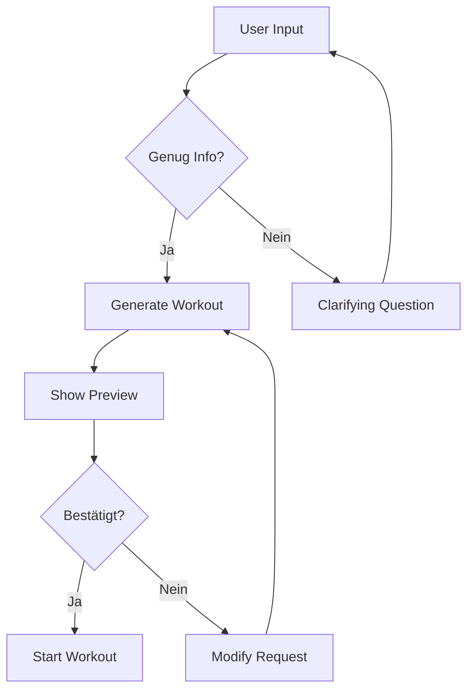

# Prompt-basierte Workout-Erstellung

## Beschreibung
User beschreibt in natürlicher Sprache was er trainieren will - der AI Coach erstellt das Workout.

## Beispiele

### Basic Request
```
User: "Brust-Workout"
AI: Generiert Standard-Brust-Workout mit Progressive Overload
```

### Mit Constraints
```
User: "Oberkörper, 45 Minuten, nur Kurzhanteln"
AI: Passt Übungsauswahl und Volumen an
```

### Mit Kontext
```
User: "Ich war gestern laufen und meine Beine sind müde"
AI: Fokussiert auf Oberkörper, vermeidet Standing Exercises
```

### Mit Ziel
```
User: "Hypertrophie-Fokus für Rücken"
AI: Höheres Volumen, Rep-Range 8-12, mehr Isolation
```

## Conversation Flow



## AI System Prompt
```
Du bist ein Fitness Coach. Basierend auf:
- User Request
- Equipment (aus Profil)
- Letzte Workouts (für Recovery)
- Aktuelle Trainingswoche (für Periodisierung)

Erstelle ein optimales Workout.
```

## Implementation
- FitnessCoachAgent erhält `create_workout` Tool
- Tool greift auf Supabase Exercise Library zu
- Progressive Overload wird automatisch berechnet
- Workout wird in Session gespeichert

## Definition of Done
- [x] 90%+ der Requests werden korrekt interpretiert ✅ (Conversational flow)
- [x] Constraints werden berücksichtigt ✅ (Zeit, Equipment, Muskelgruppe)
- [x] Workout ist sofort startbar ✅ (set_workout_exercises tool)
- [x] Modifikation vor Start möglich ✅ (via Chat)

## Implementation Notes
- `set_workout_exercises` tool added to CoachAgent
- `get_recommended_weight` tool for progressive overload
- Conversational UX: Agent asks questions before creating workout
- Web demo updated to hide internal architecture
